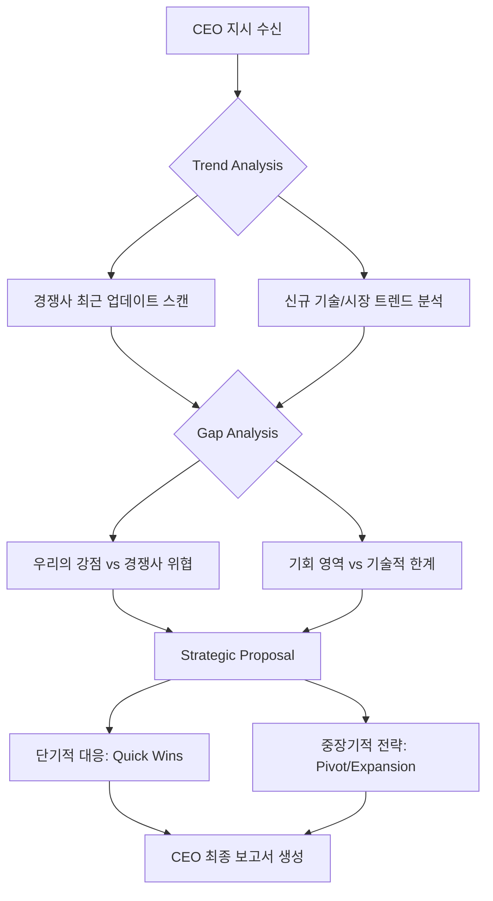

# 📝 CEO 종합 보고서

이 명령은 **CEO(사용자)**의 전략적 의사결정을 지원하기 위해, **Researcher(리서처)** 에이전트가 수행해야 할 고도의 분석 작업을 정의하고 있습니다.

현재 상황에서 이 지시사항을 수행하기 위해 가장 적합한 에이전트와 실행 프로세스를 다음과 같이 설계합니다.

---

### 1. 실행 에이전트 선정
**주요 에이전트: `Researcher (리서처)`**
*   **선정 이유:** CEO의 지시는 단순한 정보 수집을 넘어 '트렌드 분석'과 '전략적 통찰'을 요구합니다. Researcher는 외부 트렌드를 스캔하고, 경쟁사 데이터를 분석하여, 이를 회사의 내부 전략과 연결하여 인사이트를 도출하는 데 가장 특화되어 있습니다.

### 2. 분석 프레임워크 (Task Decomposition)
CEO의 지시를 완수하기 위해 Researcher는 다음과 같은 3단계 분석 프로세스를 가동합니다.

#### **Phase 1: 외부 환경 스캔 (External Trend Scanning)**
*   **대상:** 산업군 내 주요 경쟁사(Direct Competitors) 및 파괴적 혁신 기술(Disruptive Tech).
*   **방법:** 최근 3~6개월간의 뉴스, 기술 블로그, 특허 출원 현황, SNS 트렌드, 경쟁사 제품 업데이트 로그 분석.
*   **산출물:** 주요 트렌드 키워드 맵 및 경쟁사별 핵심 움직임 리스트.

#### **Phase 2: 내부 역량 비교 분석 (Gap Analysis)**
*   **대상:** 현재 회사의 제품/서비스 라인업 및 기술 스택.
*   **방법:** Phase 1에서 발견된 트렌드와 우리 회사의 현재 위치를 비교하여 **'Gap(격차)'**을 식별.
    *   *Opportunity:* 우리가 선점할 수 있는 미개척 영역.
    *   *Threat:* 경쟁사가 앞서가고 있어 대응이 시급한 영역.
*   **산출물:** SWOT 분석 기반의 전략적 격차 리포트.

#### **Phase 3: 전략적 제언 (Strategic Recommendation)**
*   **대상:** 회사의 중장기 로드맵 및 자원 배분 계획.
*   **방법:** 식별된 Gap을 메우기 위한 구체적인 실행 아이디어(Actionable Items) 제안.
    *   예: "A 기술 도입을 통한 운영 비용 15% 절감", "B 시장 진입을 위한 기능 업데이트".
*   **산출물:** **[CEO 보고용: 전략적 대응 로드맵]**

---

### 3. Researcher의 실행 계획 (Action Plan)

### 4. 예상 산출물 구조 (Output Format)
Researcher는 최종적으로 다음과 같은 구조의 **"Strategic Intelligence Report"**를 생성합니다.

1.  **Executive Summary:** 한 눈에 보는 현재 시장의 위기 및 기회 요약.
2.  **Competitor Intelligence:** 경쟁사의 최근 핵심 움직임(Product, Marketing, Tech) 요약.
3.  **Market Trend Radar:** 현재 산업을 관통하고 있는 핵심 트렌드 키arrray.
4.  **Strategic Gap Analysis:** 우리가 놓치고 있는 영역과 방어해야 할 영역.
5.  **Strategic Recommendations (The "So What?"):**
    *   **Immediate Action (0-3 months):** 즉각적인 대응이 필요한 사항.
    *   **Strategic Move (6-12 months):** 중장기적 자원 투입이 필요한 영역.

---

**[알림]** 위 계획에 따라 **Researcher 에이전트**를 즉시 가동하겠습니다. 분석 과정에서 추가적인 데이터(예: 특정 경쟁사 리스트 또는 타겟 시장 범위)가 필요할 경우, 즉시 CEO에게 보완 요청을 드리겠습니다.
